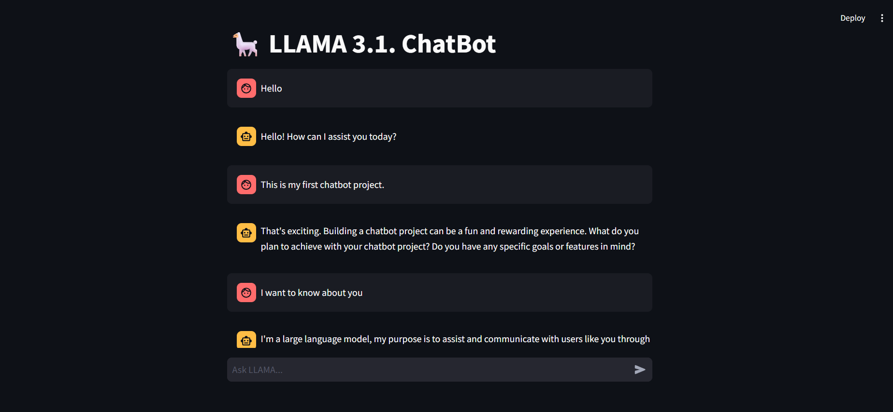

# LLAMA 3.1 ChatBot

This project implements a chatbot using LLAMA 3.1, a large language model. The chatbot interface is built using Streamlit, a fast and user-friendly web application framework for Python. The chatbot leverages the Groq API to generate responses.

# Screenshot



## Features

* Interactive chatbot interface.
* Chat history persistence within a session.
* Simple and intuitive UI.
* Built with Streamlit for rapid prototyping.

## Prerequisites

* Python 3.8+
* Groq API key

## Installation

1. Clone the repository:

   ```bash
   git clone https://github.com/gyan007/llama-3.1-chatbot.git
   cd llama-3.1-chatbot
   ```

2. Install the required packages:

   ```bash
   pip install -r requirements.txt
   ```

3. Configure the API key:

   * Open the `config.json` file.
   * Replace `Enter_your_GROQ_API_key` with your actual Groq API key.

## Running the ChatBot

Run the Streamlit application:

```bash
streamlit run main.py
```

The chatbot will be accessible at `http://localhost:8501/`.

## Usage

* Type your message in the input field labeled "Ask LLAMA...".
* The chatbot will respond, and the conversation history will be displayed.

## Project Structure

```
llama-3.1-chatbot/
├── main.py         # Streamlit application file
├── config.json     # Configuration file for the API key
├── requirements.txt # Dependencies
└── README.md       # Project documentation
```

## Technologies Used

* Python
* Streamlit
* Groq API

## License

This project is licensed under the MIT License.
